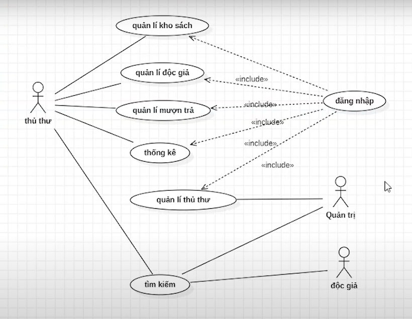
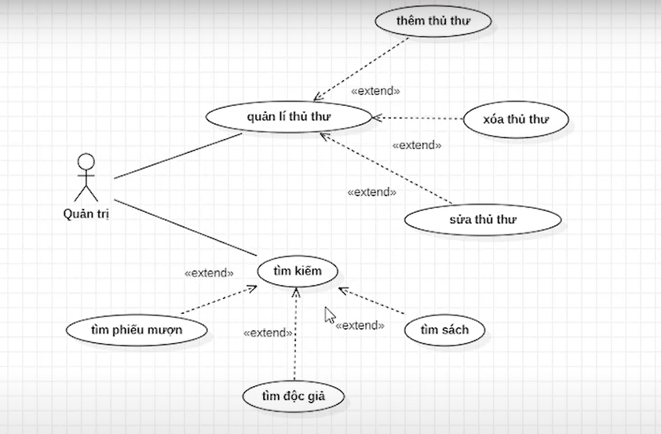
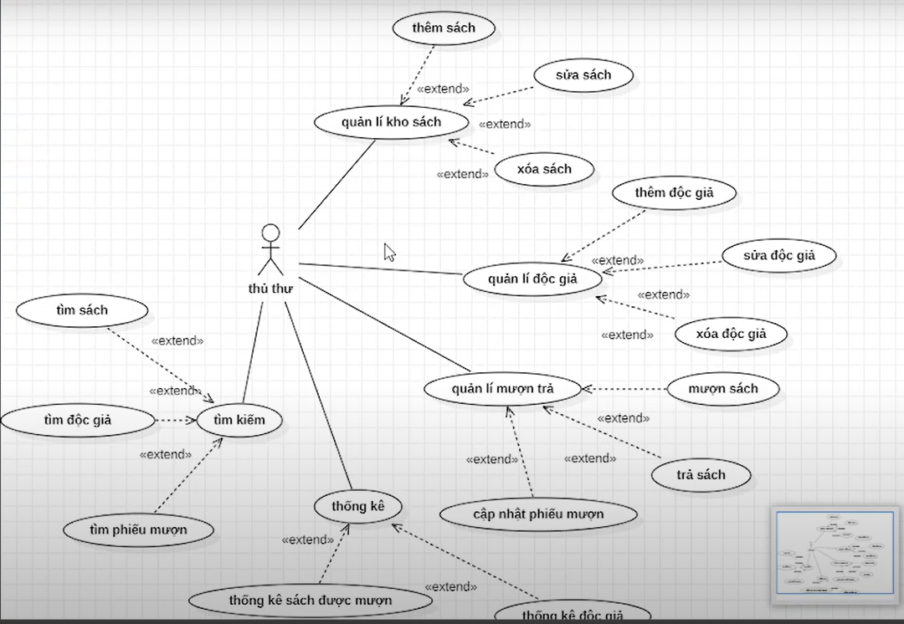
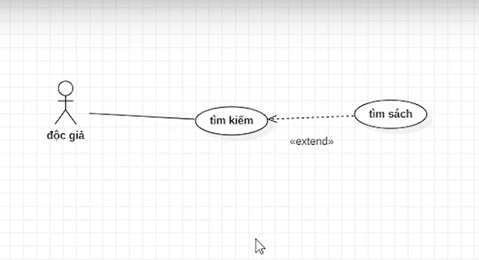

# QUẢN LÝ THƯ VIỆN
Quản lý thư viện là một phần mềm quản lý thư viện được phát triển bằng Java, JavaFX, MySQL. Dự án giúp quản lý các hoạt động chính của thư viện như thêm sách, mượn/trả sách, quản lý thông tin độc giả và theo dõi lịch sử mượn sách.

# 1 Giới thiệu
##  Mục đích
Mô tả chi tiết cho ứng dụng quản lý thư viện, các chức năng có thể sử dụng của ứng dụng. Mô tả mục đích và các tính năng của hệ thống, các giao diện, ràng buộc của hệ thống cần thực hiện để phản ứng tới các kích thích bên ngoài. 
# 2 Mô tả tổng quan
## 2.1 Các tác nhân
Phần mềm có 3 tác nhân là Người dùng, Quản trị viên, và Thủ thư. Người dùng là vai trò của một người dùng bình thường sau khi đã đăng nhập thành công vào hệ thống, thủ thư là đóng vai trò quản lý các đầu sách, cấp thẻ, quản lý mượn trả sách trong thư viện.
## 2.2 Biểu đồ use case tổng quan

## 2.3 Biểu đồ use case phân rã
### 2.3.1 Phân rã use case “Quản trị thư viện”

### 2.3.2 Phân rã use case “Thủ thư thư viện”

### 2.3.3 Phân rã use case “Độc giả thư viện”

# 3 Các chức năng 
## 3.1 Các chức năng chính
### 3.1.1 Quản lý tài liệu
* Thêm tài liệu: Thêm tài liệu mới vào danh sách thư viện.
* Xóa tài liệu: Xóa tài liệu khỏi danh sách khi không còn cần thiết.
* Sửa tài liệu: Chỉnh sửa thông tin tài liệu, như số lượng hoặc tác giả.
* Tìm kiếm tài liệu: Tìm kiếm tài liệu theo tên, tác giả, hoặc thể loại.
### 3.1.2 Quản lý người dùng thư viện
* Mượn tài liệu: Kiểm tra điều kiện trước khi cho mượn, như số lượng tài
liệu có sẵn.
* Trả tài liệu: Cập nhật trạng thái sau khi trả tài liệu.
* Thông tin thành viên: Quản lý thông tin cá nhân và trạng thái mượn tài
liệu
### 3.1.3 Xử lý các trường hợp lỗi, như kiểm tra điều kiện khi mượn tài liệu
* Kiểm tra điều kiện khi mượn tài liệu: Ví dụ, không cho phép mượn tài
liệu nếu không có sẵn.
* Thông báo lỗi: Cung cấp thông báo rõ ràng khi xảy ra lỗi, như nhập sai
thông tin.
## 3.2 Chức năng mở rộng
### 3.2.1 Xây dựng giao diện người dùng
* Sử dụng JavaFX để tạo giao diện.

  **Giao diện bao gồm:**
  * Danh sách tài liệu: Hiển thị tất cả tài liệu trong thư viện.
  * Thông tin tài liệu: Hiển thị chi tiết khi chọn một cuốn tài liệu.
  * Chức năng quản lý: Nút hoặc menu để thêm, xóa, sửa tài liệu và
thành viên.
  * Mượn/Trả tài liệu: Giao diện cho phép thành viên mượn hoặc trả
tài liệu.
### 3.2.2 Tích hợp API tra cứu thông tin tài liệu
* Sử dụng API như Google Books API để tự động lấy thông tin tài liệu
dựa tiêu đề.
* Khi thêm tài liệu mới, cho phép nhập tiêu đề tìm kiếm và tự động điền các thông
tin còn lại.
### 3.2.3 Chức năng tự sáng tạo
* Mã QR cho sách:
   * Tạo mã QR chứa thông tin sách để quản lý và kiểm tra nhanh.
   * Cho phép quét mã QR để hiển thị thông tin sách.
* ChatBot AI gemini:
   * Tăng tương tác cho người dùng, giúp dợi ý sách, tra thêm thông tin.
# 4 Tác giả
* Nguyễn Xuân Dũng
* Nguyễn Nho Dương
* Lê Tuấn Cảnh
